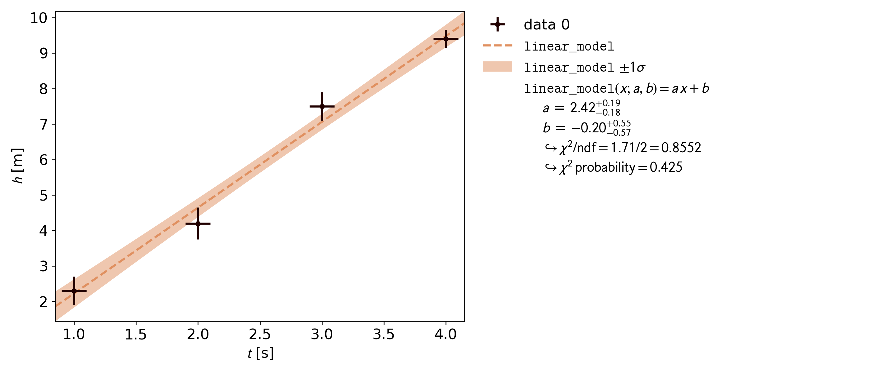

<!--
This is the source for https://kafe2.github.io/index.html,
generated via   pandoc README.md -o index.html
-->

<body style="background-color:white;">

         

  

<h1 ALIGN="center"; style="background-color:GhostWhite"> 
      <i>kafe2</i> - Data Visualisation and Model Fitting 
</h1>

> &nbsp; &nbsp; &nbsp; &nbsp; &nbsp; [**github Repository** of the *kafe2* project](
https://github.com/PhiLFitters/kafe2). 

 
  

**_kafe2_** is an open-source <i>Python</i> package designed to provide a flexible
Python interface for the estimation of model parameters from measured data.
It is the spiritual successor to the original
[*kafe*](https://github.com/dsavoiu/kafe) package.

*kafe2* offers support for several types of data types (including series of
indexed measurements, *x-y* value pairs, and histogram data) and uncertainty 
models, as well as arbitrarily complex parametric models.
The numeric aspects are handled using the scientific _Python_ stack
(*NumPy*, *SciPy*, ...). Visualization of the data and the estimated
model are provided by *matplotlib*. High-dimensional numerical optimization
and uncertainty analyis rely on the packages *scipy.optimize* or *iminuit*
(based on the MINUIT2 package developed and maintained at CERN). 

Fitting procedures in _kafe2_ are based on negative log-likelihood cost-functions
(*nlL*). As the default and for consistency with other tools, uncertainties are 
determined via the Cramér-Rao-Frechét bound, i.e. based on the 2nd derivatives 
of the *nlL* function with respect to the parameters. Optionally, one and
two-dimensional scans of the profile likelihood can be performed, which provide 
asymmetric confidence intervals for the parameter values, as is shown in the 
example below.

Handling different kinds of uncertainties is one of the unique features 
of the *kafe2* package. Data points are affected by uncertainties in the
*x* and *y* directions, which may be absolute, relative, uncorrelated or 
correlated among all or groups of data points. These different kinds of 
uncertainties are all supported by *kafe2* and taken into account by 
construction of the overall covariance matrix in each step of the numerical
optimization. This is particularly important for relative uncertainties and 
for uncertainties in the *x*-direction, which depend on the model values rather 
than on the observed values in data. This procedure is numerically expensive, 
but avoids biases in the predicted parameters and leads to an optimal statistical 
coverage of the confidence intervals derived for the parameter estimates.

Code, documentation and examples are available in the 
[**Repository** of the *kafe2* project](https://github.com/PhiLFitters/kafe2). 

